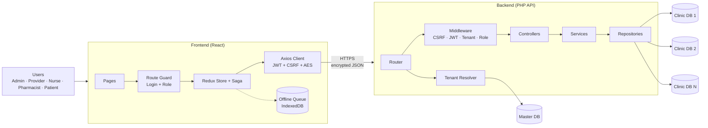
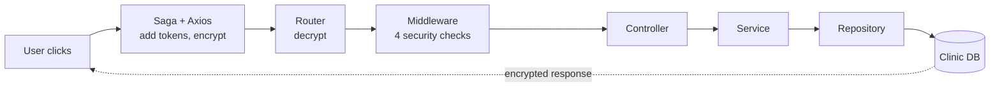
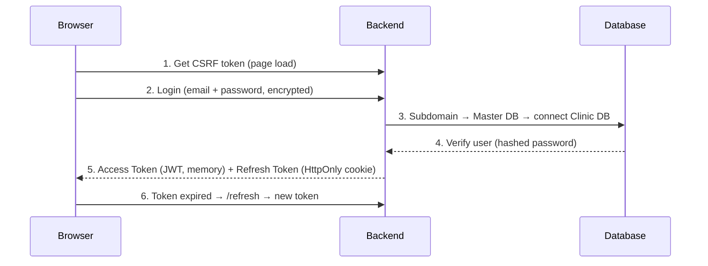
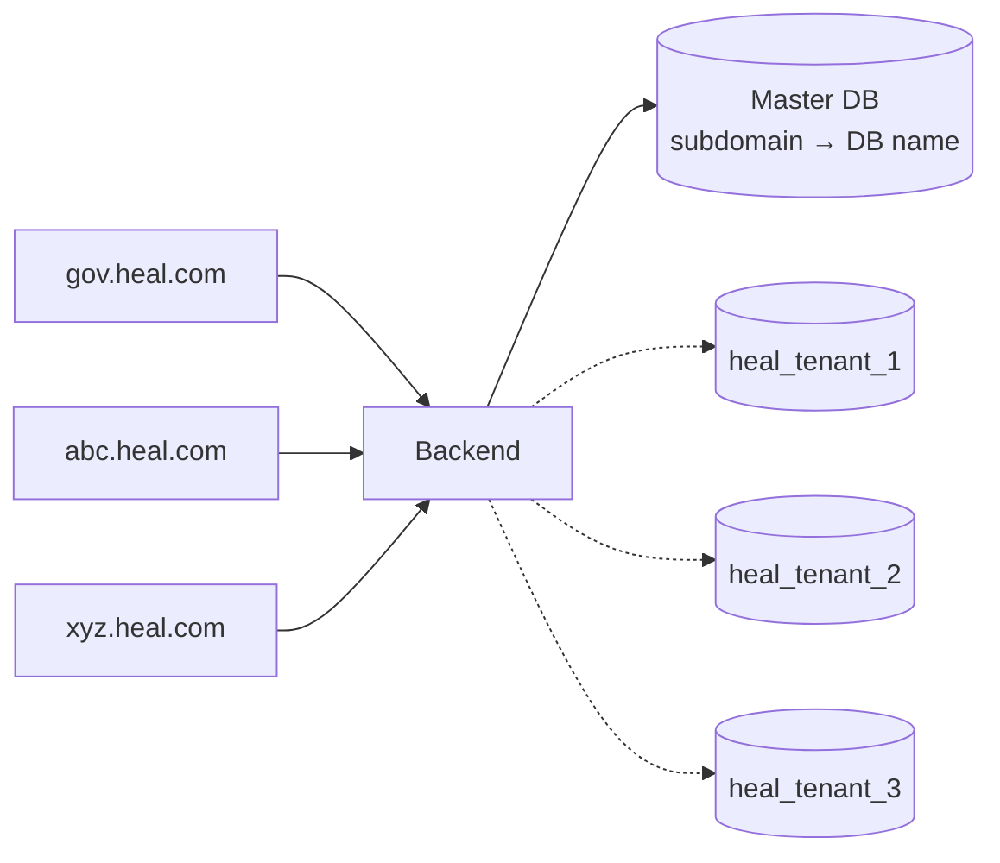
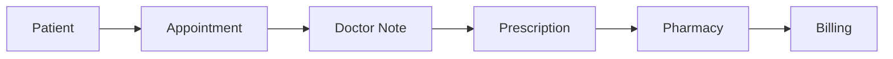

# Healthcare Management System

A multi-tenant healthcare platform. Each clinic gets its own subdomain and its own secure database.

**Stack:** React 19 · Redux Toolkit · Redux Saga · Axios · styled-components · PHP · MySQL · JWT · AES-256

---

## 1. Architecture



| Layer | Responsibility |
|---|---|
| Frontend | UI, state, API calls, offline support |
| Backend | Security checks, business rules |
| Master DB | Clinic list, subscriptions, which DB belongs to which clinic |
| Clinic DB | Users, patients, appointments, prescriptions, billing, chat (one DB per clinic) |

---

## 2. Request Flow (every click)



---

## 3. Login Flow



Auto-logout happens when the user is idle.

---

## 4. Multi-Tenant Design



- **Signup (`/tenant/register`)**: Master DB entry → new database `heal_tenant_<id>` → tables from `tenant_schema.sql` → first Admin user.
- **Safety check**: tenant in the URL must match the tenant inside the JWT, otherwise the request is blocked.

---

## 5. Modules



Supporting modules: Dashboard · Calendar · Chat · Notifications · Staff · User Management · Tenant Settings

### Role Access

| Page | Admin | Provider | Nurse | Pharmacist |
|---|:-:|:-:|:-:|:-:|
| Dashboard, Patients, Appointments | ✅ | ✅ | ✅ | ✅ |
| Prescriptions | – | ✅ | – | ✅ |
| Billing | ✅ | ✅ | ✅ | – |
| Staff | ✅ | – | – | – |
| Notifications | – | ✅ | – | – |

---

## 6. Security

| Feature | What it does |
|---|---|
| AES-256 | Encrypts request/response payload and sensitive DB fields |
| JWT + Refresh Token | Short-lived access token; refresh token in HttpOnly cookie |
| CSRF Token | Required on every non-GET request |
| RBAC | Role checked in frontend routes and backend |
| Tenant Check | URL clinic must match token clinic |
| Idle Logout | Signs out inactive users |
| Offline Mode | Changes saved encrypted in IndexedDB, synced when online |

---

## 7. Folder Structure

```
healthcare-frontend/src
├── app/         store, rootReducer, rootSaga
├── modules/     auth, patients, appointments, billing ... (slice + saga + API + hook)
├── pages/       screens
├── routes/      AppRouter, ProtectedRoute, RoleBasedRoute
├── services/    axiosClient, tokenService, encryptionService
└── themes/      per-clinic theme

healthcare-api/backend/app
├── Routes/ · Middleware/ · Controllers/
├── Services/ · Repositories/
├── Security/    AES, JWT, CSRF, Hash
└── Config/      env + master database
healthcare-api/database   master_schema.sql, tenant_schema.sql
```

**Pattern:** Frontend `Page → Hook → Slice → Saga → API` · Backend `Route → Controller → Service → Repository → DB`

---

## 8. Setup

```bash
# Frontend
cd healthcare-frontend
npm install
npm start

# Backend
cd healthcare-api
composer install
# Import database/master_schema.sql into MySQL, then configure backend/.env
```

Set `REACT_APP_API_PATH` and `REACT_APP_AES_KEY` in the frontend `.env` (the AES key must match the backend `AES_KEY`). Never commit real keys or credentials.
